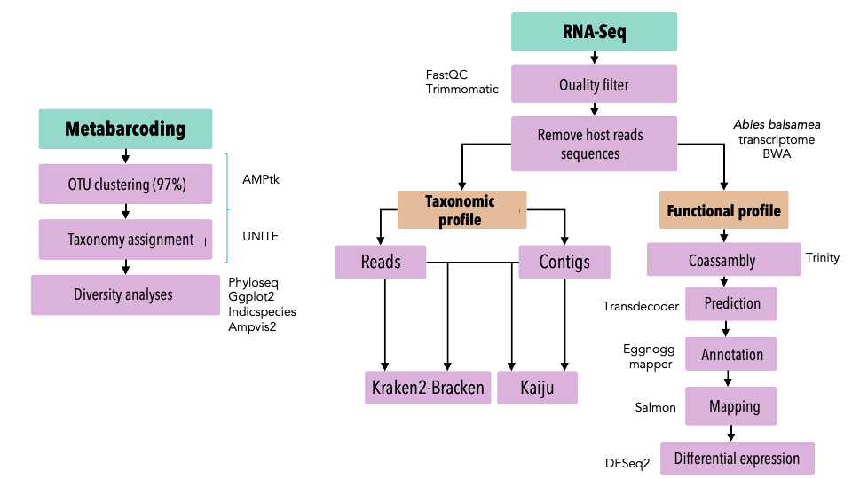

# 
 Role of endophytic fungi in the resistance of sacred fir (*Abies religiosa*) to air pollution 

### 
  :construction::construction::construction::construction: REPOSITORY UNDER CONSTRUCTION :construction::construction::construction::construction: 

Air pollution by tropospheric ozone (O3) is causing the strong decline of sacred fir (*Abies religiosa*) in peripheral areas of Mexico City. However, within high contaminated zones, variation in the level of damage to air pollution was detected among fir individuals. These results suggest that there is genetic variability related to tolerance to (O3). Due to their effects on plant resistance to abiotic stresses, it is very likely that endophytic fungi present inside fir leaves are involved in resistance to air pollution.

In this repository, you will find the workflow of a metatranscriptomics analysis from *Abies religiosa* indivuals exposed to high (O3) concentrations and showed 2 different phenotypes (tolerant and damaged). 

## **Aims**

1. To characterize the diversity of fungal endophytes inside the leaves of tolerant and damaged fir individuals.
2. To detect differential expression of fungal genes from tolerant and damaged fir individuals. 
3. To identify fungal genes putitive involved in the resistance of air pollution caused by (O3).

## **Prerequisites**

* [FastQC](https://www.bioinformatics.babraham.ac.uk/projects/fastqc/)
* [Trimmomatic-0.39](http://www.usadellab.org/cms/?page=trimmomatic)
* [BWA-0.7.17](http://bio-bwa.sourceforge.net)
* [samtools-1.10](http://www.htslib.org)
* [SPADES-3.14.1](https://cab.spbu.ru/software/spades/)
* [MaxBin2-2.2.4-1](https://sourceforge.net/projects/maxbin2/)
* [Kraken2](https://ccb.jhu.edu/software/kraken2/)
* [Kaiju-1.7.3](http://kaiju.binf.ku.dk)
* [Prodigal-2.6.3](https://github.com/hyattpd/Prodigal)
* [Diamond-2.0.5](https://github.com/bbuchfink/diamond)	

## **Data**

The data comes from Veronica Reyes Galindo's project [***Abies* vs ozone**](https://github.com/VeroIarrachtai/Abies_vs_ozone). For more information about the samples see the folder [**metadata**](https://github.com/VeroIarrachtai/Abies_vs_ozone/blob/master/4_Transcriptomics/metadata/RNA_sacredfir.csv).

For this project **16** samples in total were used:

* **8** samples **tolerant**.
* **8** samples **damaged**.  

## **Workflow**

## **Repository structure**

This repository contains the following folders:

>### /bin/

Contains scripts to perform the analysis

* **README.md**: Contains the pipeline in detail and specifies the order in which each script must be called.
* **01_filter.sh:** Performs quality analysis with FastQC, adapters deletion and paired-end read merging with *Trimmomatic*.
* **02_removehost.sh:** Deletes host reads (*A. religiosa*) with BWA by mapping the paired and unpaired reads to the reference transcriptome and saves the unmapped reads (paired and unpaired) with *samtools*.
* **03_assembly.sh:** Performs the reads assembly into contigs using *metaSPADES*.
* **04_binning.sh:** Group the contigs into bins with *MaxBin*.
* **05_kraken.sh:** Performs a taxonomic profile to reads and bins using *Kraken*.
* **06_kaiju.sh:** Performs a taxonomic profile ro reads and bins using *Kaiju*.
* **07_prediction.sh:** Performs the genes prediction from the bins using *Prodigal*.
* **08_annotation.sh:** Annotates the predicted genes by comparing them against the Non-Redundant (NR) protein database.
  
  
>### /data/

Contains the raw data and each analysis output. The folder contains the subfolders:

#### /raw/
Contains each file in (`.fq.gzip`) format from the 16 samples.

#### /filter/

Contains the following subfolders:

##### * **/outputs/:** with the outputs from the filtering process (trimming with *Trimmomatic* and host reads remotion with *BWA* and *samtools*):

* Paired reads (in `.fq.gzip`)
* Unpaired reads (in `.fq.gzip`)
* Mapped paired host reads (in `.sam`, `.bam` and `.fastq`)
* Mapped unpaired host reads (in `.sam`, `.bam` and `.fastq`)
* Unmapped paired reads (in `.sam`, `.bam` and `.fastq`)
* Unmapped unpaired host reads (in `.sam`, `.bam` and `.fastq`)
* Concatenated paired and unpaired unmapped reads (in `.fastq`, `.fasta` and `.sam`)
 
 
* ##### **/adapters/:** with a symbolic link to the adapters folder from Trimmomatic data.
* ##### **/reference/:** with the *A. balsamea* reference transcriptome in `.fa`files.
* ##### **/index/:** with the *A. balsamea* transcriptome index generated with bwa.
  

#### /assembly/
Contains subfolders with metaSPADES outputs from every sample (Every subfolder is called: `samplename_assembly`).

#### /binning/
Contains the output from MaxBin.

#### /taxonomy/
Contains the subfolders `/kraken/` and `/kaiju/` with every software output from reads and bins. 

#### /function/
Contains the subfolders `/prediction/`and `/annotation/`with every output from *Prodigal* and *Diamond* respectively.

>### /metadata/

Contains the subfolder `reports` with the output report from *fastqc*, *Trimmomatic*, *BWA* and *SPADES* in `.log` or .`txt`. 

>### /parkinsonlabtutorial/

This folder was made to follow the Parkinson's Lab tutorial Some of the steps of the tutorial are gonna be adapted. This folder will be deleted once the scripts are adapted.

>### /archive/

Contains the presentation for methodological topic seminar were I spoke about the approaches to look for fungal signals in RNA-Seq data.

Alson contains the subfolder `tutorales` with each of the 5 tutoral presentations.  

