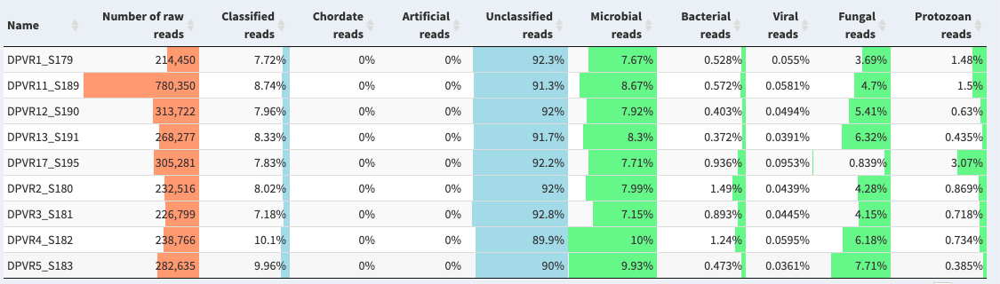
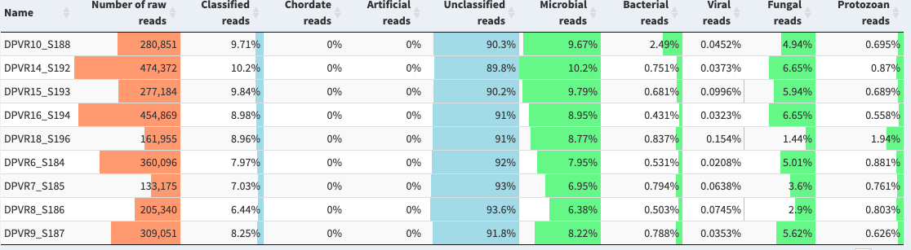
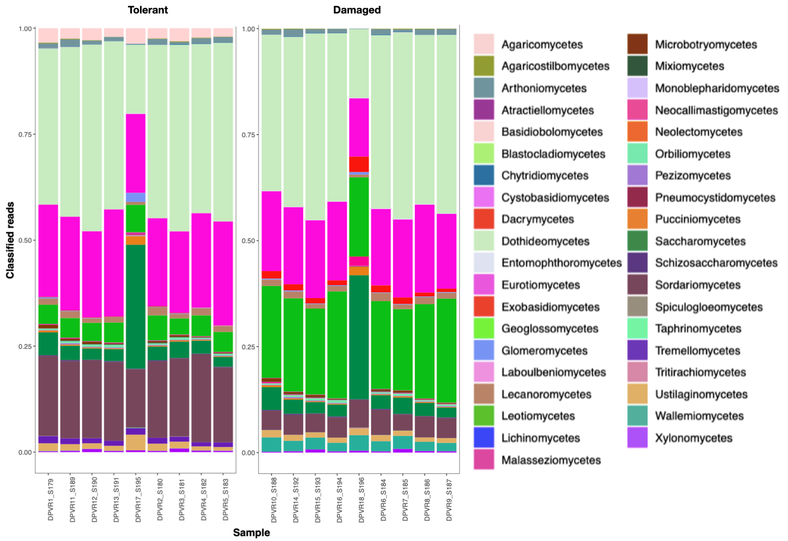

# Clasificación de lecturas con Krakenuniq

Un gran porcentaje (más del 89%) de las lecturas de las muestras **tolerantes** (Figura 1) y **dañadas** (Figura 2) no tuvieron clasificación con el programa KrakenUniq *ver [bin/03_krakenreads.sh](./../bin/03_krakenreads.sh)*. 

**Figura 1:** Resumen generado con Pavian de la clasificación del conjunto de muestras *tolerantes*.

**Figura 2:** Resumen generado con Pavian de la clasificación del conjunto de muestras *dañadas*.

En general, la mayoría de las lecturas que sí fueron clasificadas pertenecían a hongos. En cuanto a los hongos clasificados, se observan diferencias en las abundancias relativas de distintas clases fúngicas (Figura 3). Tanto en las muestras tolerantes y dañadas, la clase Dothideomycetes se presenta en mayor abundancia, seguida de la clase Eurotiomycetes.

 

**Figura 3:** Abundancia relativa de clases fúngicas obtenidas con el análisis en KrakenUniq de las lecturas de individuos **tolerantes** y **dañados**.

Las abundancias relativas fueron generadas a partir del reporte interactivo de cada grupo de muestras (tolerantes y dañadas) generado con Pavian *ver [../metadata/reports] (./../metadata/reports)*, en donde se seleccionó Comparison, en búsqueda se colocó *fungi*, se seleccionó el rango de clase y se descargo el archivo *.csv*. A la tabla generada se le eliminaron las columnas **Rank**, **TID** y **Max**. Posteriormente se graficó la abundancia relativa utilizando [figures/bin/07_krakenplotreads.R](./bin/07_krakenplotreads.R).
