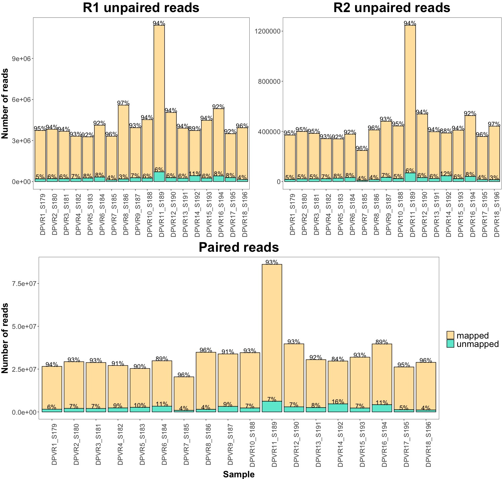

## Quality filter
**author:** Valeria Flores

**date:** 19/01/2021

In order to keep as much information as possible in the metatranscriptomic analysis, it was proposed to use the unpaired data that resulted from the quality filter process. But first, it is important to know how many reads remained. 

I used the script **[../bin/01_quality.sh](../bin/01_quality.sh)** to remove low quality reads.

To extract the information from the trimmomatic report, I used the **[bin/01_extract_trimmomatic.sh](./bin/01_extract_trimmomatic.sh)** script. Then, to make a ggplotable file I used the **[bin/02_cleanreadstable.R](./02_bin/cleanreadstable.R)**. Finally I used the **[bin/03_quality_barplot.sh](./bin/03_quality_barplot.R)**.

The resulting plot was:

**Figure 1:** Number of reads after trimming process.

In the **Figure 1** we can see that the number of reads among samples are heterogeneous, but the sample DPVR11_S189 has visibly more number of reads. This sample will continue to be used, but it is important to keep in mind the number of reads bias if this sample shows different results in the following analyses. This sample could have more reads due to errors in sequetiation process as more sample could have been loaded in the NGS instrument or PCR bias in library preparation.

To clearly visualize the percentage of each category I made an percent stacked barchart included in the **[bin/03_quality_barplot.sh](./bin/03_quality_barplot.R)** script:

**Figure 2:** Percentage of paired, unpaired and dropped reads after trimming process.

In the **Figure 2** we can see that, after the trimming process,  the most of the reads in all samples are paired reads. There are still a big portion of R1 unpaired reads (in dark brown). The R2 unpaired reads (in pink) are less in comparison with R1, but it can still be used in posterior analyses. 

After the quality filter process, the reads were mapped to the *Abies balsamea* transcriptome. The unpaired reads were taken as single end. To visualize the **number of mapped or unmapped** reads, it was necessary to extract the information, this could be done in more than one way, but I used *samtools* **[bin/04_extract_mapping.sh](./bin/04_extract_mapping.sh)** to generate a file with the sample name, total reads, mapped, and unmapped reads **[data/countmappedreads.txt](./data/countmappedreads.csv)**. In order to separate the sample name and if the information about the file, this table was manually edited into **[data/edited_count_map.csv](./data/edited_count_map.csv)**. The **[bin/05_import_samtools_results.R](./bin/05_import_samtools_results.R)** script reshapes the table to create three variables **R1_unpaired**, **R2_unpaired** and **paired**, that makes easier to call them in *ggplot2*. The reshaped table is the **[bin/mapping.csv](./bin/mapping.csv)**. Finally, the **[bin/06_mapping_plot.R](./data/06_mapping_plot.R)** makes a barplot from the unpaired and paired reads and groups the three tables in one.

**Figure 3:** Number of reads that mapped to the *A. balsamea* reference transcriptome.

In the **Figure 3** we can see that, among the samples and unpaired and paired reads, there are not more than 12% of the reads that do not map to the reference. According to the mapping process, almost the 90% of the reads were host transcripts. 

Although the vast majority of *Abies* reads, there are still reads that may come from plan-associated microorganisms sources. So, the next workflow steps are needed to determine if taxonomy can be assigned by removing host reads.

