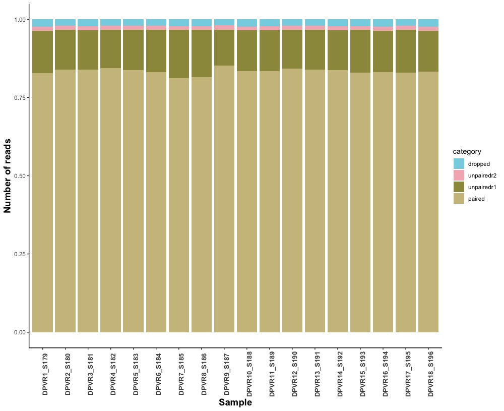

## Quality filter
**author:** Valeria Flores
**date:** 19/01/2021

I used the script **[../bin/01_quality.sh](../bin/01_quality.sh)** to remove low quality reads.

I wanted to know how much reads remained, so, to extract the information  from the trimmomatic report, I used the **[bin/extract_trimmomatic.sh](./bin/extract_trimmomatic.sh)** script. Then, to make a ggplotable file I used the **[bin/cleanreadstable.R](./bin/cleanreadstable.R)**. Finally I used the **[bin/quality_barplot.sh](./bin/quality_barplot.R)**.

The resulting plot was:

**Figure 1:** Number of reads after trimming process.

In the **Figure 1** we can see that the rnumber of reads are heterogeneous, but the sample DPVR11_S189 has visibly more number of reads.

To clearly visualize the percentage of each category I made an percent stacked barchart included in the **[bin/quality_barplot.sh](./bin/quality_barplot.R)** script:

**Figure 2:** Percentage of paired, unpaired and dropped reads after trimming process.

In the **Figure 2** we can see that, after the trimming process,  the most of the reads in all samples are paired reads. There are still a portion of R1 unpaired reads. The R2 unpaired reads (in pink) can be discarded.

