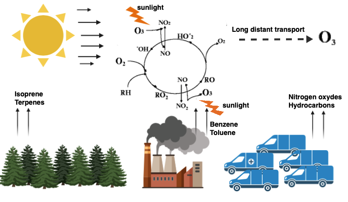

# Hongos endófitos y su papel en la resistencia de *Abies reigiosa* a la contaminación del aire

### Posgrado en Ciencias Biológicas
### Tutoral 0

**Valeria Stephany Flores Almaraz**

#### Tutores principales:

* Dra. Camille Truong 
* Dr. Rodolfo Salas Lizana

#### Comité tutoral: 
* Dra. Alicia Mastretta Yanes
* Dr. Juan Pablo Jaramillo Correa

## Introducción

### Ozono tropsférico (O3)
El ozono troposférico (**O3**) es un contaminante del aire cuyas concentraciones se incrementaron drásticamente a partir de la Revolución Industrial, debido a que las intensas actividades productivas y el crecimiento de la población aumenta las emisiones de sus precursores, como los óxidos de nitrógeno (**NOx**) y los compuestos orgánicos volátiles (**VOCs**) (Cho *et al.*, 2011; Saxena *et al.*, 2019).

 

**Figura 1.** Fuentes del ozono troposférico. 